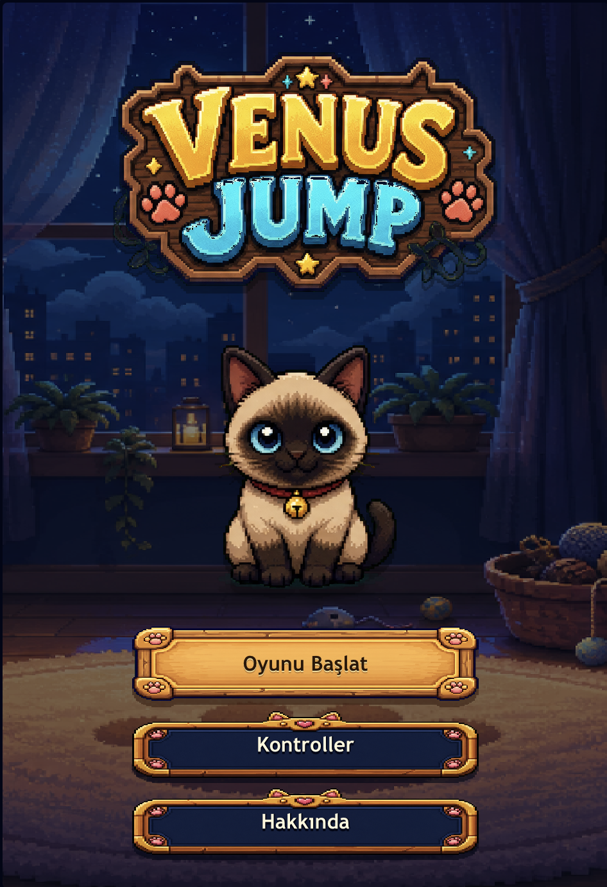
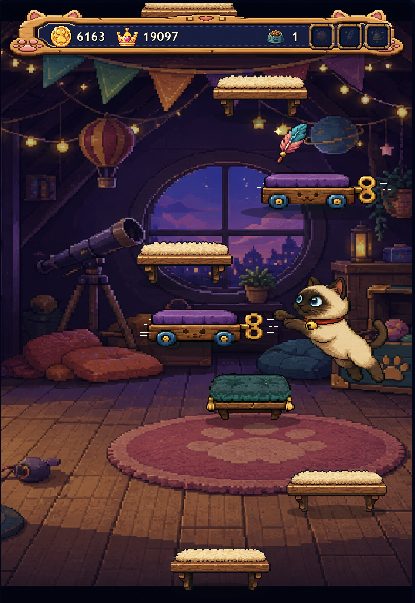

# Venus Jump

Venus Jump is a cozy pixel art arcade jumper starring Venus, a bright-eyed cat climbing through dreamy rooms, rooftops, shelves, cushions, and tiny night-sky corners. The game is playable at [venus.emrebc.com](https://venus.emrebc.com).

## About

Venus jumps automatically. Your job is to guide her left and right, choose the safest route upward, collect bonuses, and keep the climb going as long as possible. The score rises with height, high scores are saved locally, and each run becomes more demanding as platforms get tighter and more varied.

The game is designed around a warm, hand-crafted pixel art style: chunky wooden UI frames, soft room lighting, plush cat-themed platforms, and collectible objects that feel like they belong in Venus' little world. The visual direction favors a playful, storybook arcade mood instead of a minimal abstract interface.

## Screenshots

<p>
  
  
</p>

## Gameplay

- Guide Venus with the left/right arrow keys or `A`/`D`.
- On touch screens, swipe left or right on the game area.
- Land on platforms to keep climbing.
- Avoid falling below the screen.
- Collect items to extend a run and create better scoring opportunities.

## Platforms

- Normal shelves are reliable landing spots.
- Bouncy cushions launch Venus higher.
- Cracked shelves are risky and break after being touched.
- Moving shelves slide sideways and require better timing.

## Collectibles

- Cat food gives Venus an extra recovery chance, up to three.
- Yarn grants a stronger jump for a short time.
- Feather improves air control.
- Gold bell activates a temporary protective shield.

## Tech Stack

- TypeScript
- Vite
- HTML Canvas
- CSS

## Development

Install dependencies:

```bash
npm install
```

Start the local dev server:

```bash
npm run dev
```

Create a production build:

```bash
npm run build
```

Run the platform generation logic check:

```bash
npm run test:logic
```

## Live

Play Venus Jump here: [https://venus.emrebc.com](https://venus.emrebc.com)
